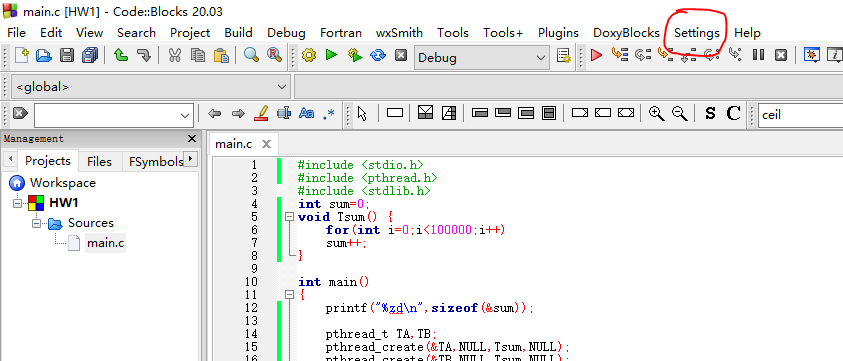
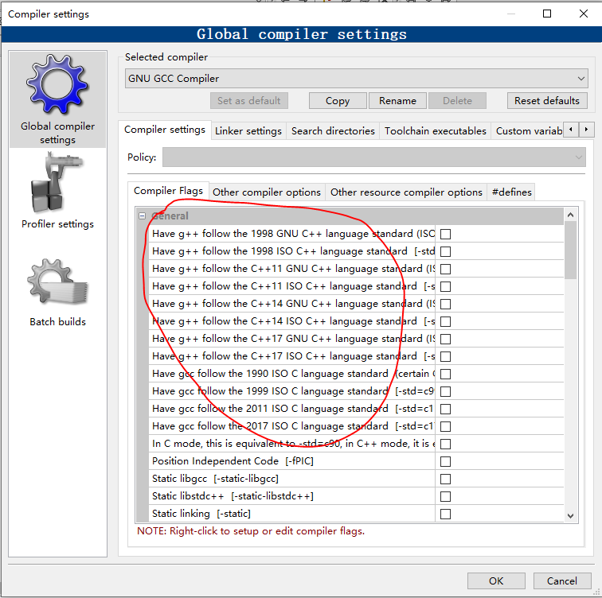
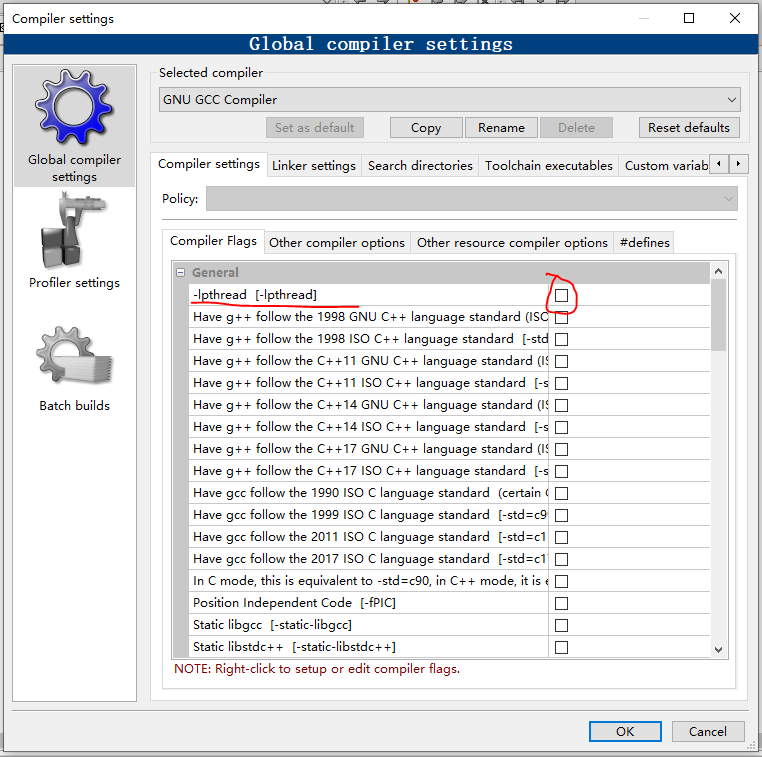
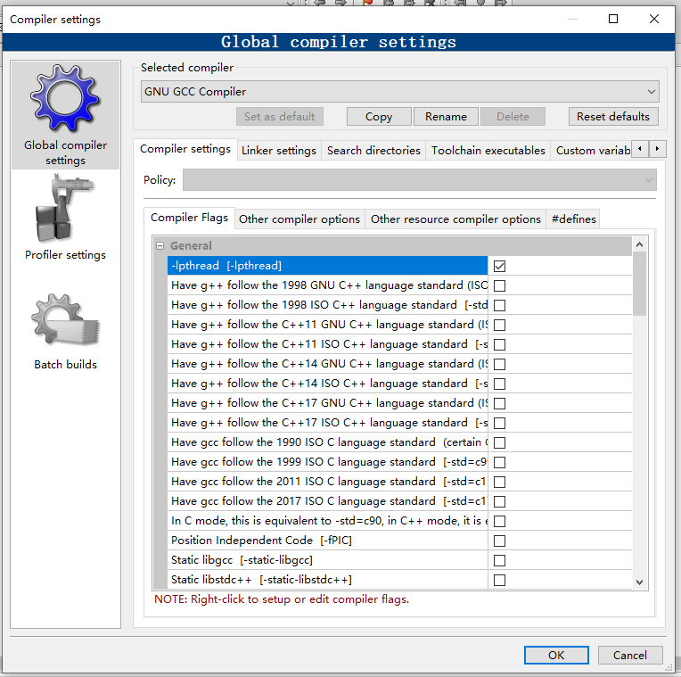

# 操作系统作业
## 概述
作业对应的代码在`source.c`文件中，`verify.c`提供了一个小程序验证 
在`Ubuntu22.04`下测试通过
## Windows下Codeblocks下的配置
1.打开Codeblocks，点击Setting菜单栏，点击compiler选项 
 
2.在圈起来的区域右键，点击"New flag..."选项 
 
3.弹出的窗口中填入如下参数后点击"OK" 
 
4.（尝试下拉后）应该可以看到一个名叫"-lpthread"的选项，点击启用 
 
5.与下图大致相同的时候点击OK退出，此时应该能够正常工作 
 

